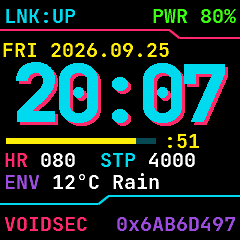
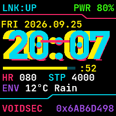
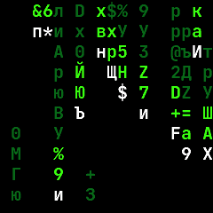
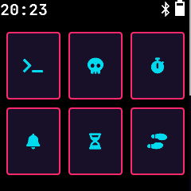
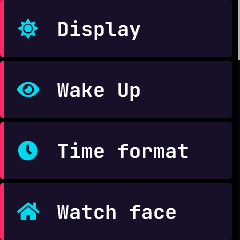
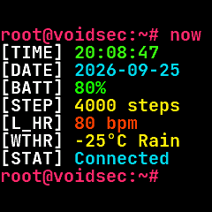

 

# InfiniTime

*Fast open-source firmware for the [PineTime smartwatch](https://pine64.org/devices/pinetime/) with many features, written in modern C++.*

 

## // CYBERPUNK EDITION

This fork reworks InfiniTime into a neon, hacker-con-ready build for the PineTime.

| NetRunner | Glitch | Matrix | Badge |
|:-:|:-:|:-:|:-:|
|  |  |  |  |
| **Launcher** | **Settings** | **Terminal** | |
|  |  |  | |

What's different from upstream:

- **NetRunner watch face** (new default): chromatic-aberration time with random glitch bursts plus a guaranteed glitch every minute, HUD frame lines, seconds sweep bar, link/power status, HR + steps, weather, and the Unix epoch in hex. The handle in the bottom-left corner comes from `src/Identity.h`.
- **Matrix app**: digital rain built from ASCII and Cyrillic glyphs. Tap to cycle green, cyan, and magenta palettes.
- **Badge app** (skull icon): your handle and a scannable QR code linking to your GitHub. The screen stays on while it is open. To point it somewhere else, run `python3 tools/badge/generate_badge_qr.py <url>` (needs `pip install segno`).
- **Bluetooth name** is your handle (`VOIDSEC`), set in `src/Identity.h`. Gadgetbridge only auto-detects watches whose name starts with `InfiniTime`, so pair it before flashing this firmware, or temporarily change the name back to pair.
- **Heart rate in the background**: measurement starts at boot and runs every 5 minutes by default, so you never have to open the heart rate app. If no pulse is found for 30 seconds (the watch is off your wrist or on the charger), it backs off and retries every 5 minutes, so even *Cont* mode doesn't run the sensor all day on the nightstand. Change the interval in *Settings → Heart rate*.
- **Neon theme**: cyan and magenta outlined buttons, sharp corners, dark purple surfaces, and recolored launcher tiles, lists, sliders, and switches.
- **Terminal face** recolored as a root shell.
- **Trimmed build**: Paint, Paddle, 2048, Dice, and Metronome apps plus the Analog, PineTimeStyle, Infineat, Casio, and Pride Flag faces are no longer built by default, which frees about 49 KB of flash. Re-enable any of them in `src/displayapp/apps/CMakeLists.txt`.

> If your watch already has saved settings, pick NetRunner in *Settings → Watch face*.

## New to InfiniTime?

- [Getting started with InfiniTime](doc/gettingStarted/gettingStarted-1.0.md)
- [Updating the software](doc/gettingStarted/updating-software.md)
- [About the firmware and bootloader](doc/gettingStarted/about-software.md)
- [Available apps](doc/gettingStarted/Applications.md)
- [Available watch faces](/doc/gettingStarted/Watchfaces.md)
- [PineTimeStyle Watch face](https://pine64.org/documentation/PineTime/Watchfaces/PineTimeStyle)
  - [Weather integration](https://pine64.org/documentation/PineTime/Software/InfiniTime_weather/)

### Companion apps

- [Gadgetbridge](https://gadgetbridge.org/) (Android)
- [Amazfish](https://github.com/piggz/harbour-amazfish/) ([SailfishOS](https://sailfishos-chum.github.io/apps/harbour-amazfish/), [Ubuntu Touch](https://open-store.io/app/uk.co.piggz.amazfish), [Flatpak](https://flathub.org/apps/uk.co.piggz.amazfish))
- [Siglo](https://github.com/alexr4535/siglo) (Linux)
- [InfiniLink](https://github.com/InfiniTimeOrg/InfiniLink) (iOS)
- [ITD](https://gitea.elara.ws/Elara6331/itd) (Linux)
- [WatchMate](https://github.com/azymohliad/watchmate) (Linux)
- [InfiniTimeExplorer](https://infinitimeexplorer.netlify.app) (Web)

 

> *InfiniTimeExplorer is only compatible with web browsers that support Web BLE. Current fully supported browsers include Chrome and Microsoft Edge.* 
>
> *We removed mentions to NRFConnect as this app is closed source and recent versions do not work anymore with InfiniTime (the last version known to work is 4.24.3). If you used NRFConnect in the past, we recommend you switch to [Gadgetbridge](https://gadgetbridge.org/).* 

## Development

- [InfiniTime Vision](doc/InfiniTimeVision.md)
- [Rough structure of the code](doc/code/Intro.md)
- [How to implement an application](doc/code/Apps.md)
- [Generate the fonts and symbols](src/displayapp/fonts/README.md)
- [Tips on designing an app UI](doc/ui_guidelines.md)
- [Bootloader, OTA and DFU](bootloader/README.md)
- [External resources](doc/ExternalResources.md)

### Contributing

- [How to contribute](CONTRIBUTING.md)
- [Coding conventions](doc/coding-convention.md)

### Build, flash and debug

- [InfiniTime simulator](https://github.com/InfiniTimeOrg/InfiniSim)
- [Build the project](doc/buildAndProgram.md)
- [Build the project with Docker](doc/buildWithDocker.md)
- [Build the project with VSCode](doc/buildWithVScode.md)
- [Flash the firmware using OpenOCD and STLinkV2](doc/openOCD.md)
- [Flash the firmware using SWD interface](doc/SWD.md)
- [Flash the firmware using JLink](doc/jlink.md)
- [Flash the firmware using GDB](doc/gdb.md)
- [Stub using NRF52-DK](doc/PinetimeStubWithNrf52DK.md)

### API

- [BLE implementation and API](doc/ble.md)

### Architecture and technical topics

- [Memory analysis](doc/MemoryAnalysis.md)

### Project management

- [Maintainer's guide](doc/maintainer-guide.md)
- [Versioning](doc/versioning.md)
- [Project branches](doc/branches.md)
- [Files included in the release notes](doc/filesInReleaseNotes.md)
- [Files needed by the factory](doc/files-needed-by-factory.md)

## Licenses

This project is released under the GNU General Public License version 3 or, at your option, any later version.

It integrates the following projects:

- RTOS: **[FreeRTOS](https://freertos.org)** under the MIT license
- UI: **[LittleVGL/LVGL](https://lvgl.io/)** under the MIT license
- BLE stack: **[NimBLE](https://github.com/apache/mynewt-nimble)** under the Apache 2.0 license
- Font: **[Jetbrains Mono](https://www.jetbrains.com/fr-fr/lp/mono/)** under the Apache 2.0 license

## Credits

I’m not working alone on this project. First, many people create pull requests for this project. Then, there is the whole #pinetime community: a lot of people all around the world who are hacking, searching, experimenting and programming the Pinetime. We exchange our ideas, experiments and code in the chat rooms and forums.

Here are some people I would like to highlight:

- [Atc1441](https://github.com/atc1441/): He works on an Arduino based firmware for the Pinetime and many other smartwatches based on similar hardware. He was of great help when I was implementing support for the BMA421 motion sensor and I²C driver.
- [Koen](https://github.com/bosmoment): He’s working on a firmware based on RiotOS. He integrated similar libs as me: NimBLE, LittleVGL,… His help was invaluable too!
- [Lup Yuen Lee](https://github.com/lupyuen): He is everywhere: he works on a Rust firmware, builds a MCUBoot based bootloader for the Pinetime, designs a Flutter based companion app for smartphones and writes a lot of articles about the Pinetime!
